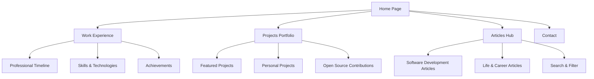
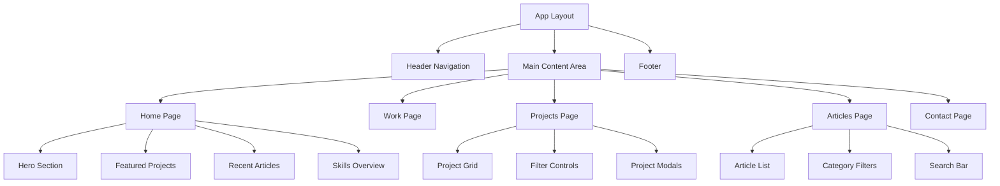

# Portfolio Website Architecture Documentation

## 🎯 Project Overview

This document outlines the complete architecture for KalkiEshwar's professional portfolio website. The site focuses on showcasing professional work, projects, and thought leadership through articles, built with modern web technologies for maintainability and performance.

## 🏗️ Technology Stack

### Core Framework
- **Next.js 14+** - React framework with TypeScript support
- **TypeScript** - Type-safe development
- **React 18** - Component-based UI library

### Styling & Animation
- **Tailwind CSS** - Utility-first CSS framework
- **Framer Motion** - Smooth animations and transitions
- **CSS Modules** - Component-scoped styling (when needed)

### Content Management
- **MDX** - Markdown with JSX for articles
- **Gray-matter** - Frontmatter parsing
- **Remark/Rehype** - Markdown processing pipeline

### Development Tools
- **ESLint** - Code linting
- **Prettier** - Code formatting
- **Husky** - Git hooks
- **TypeScript** - Static type checking

### Deployment
- **GitHub Pages** - Static hosting
- **GitHub Actions** - CI/CD pipeline
- **Custom Domain** - kalkieshward.me

## 📁 Project Structure

```
portfolio-website/
├── public/
│   ├── images/
│   │   ├── projects/          # Project screenshots
│   │   ├── work/              # Company logos
│   │   └── profile/           # Personal photos
│   ├── icons/
│   │   ├── tech/              # Technology icons
│   │   └── social/            # Social media icons
│   ├── documents/
│   │   └── resume.pdf         # Downloadable resume
│   └── favicon.ico
├── src/
│   ├── components/
│   │   ├── ui/                # Reusable UI components
│   │   │   ├── Button.tsx
│   │   │   ├── Card.tsx
│   │   │   ├── Badge.tsx
│   │   │   ├── Modal.tsx
│   │   │   └── Input.tsx
│   │   ├── layout/            # Layout components
│   │   │   ├── Header.tsx
│   │   │   ├── Footer.tsx
│   │   │   ├── Layout.tsx
│   │   │   └── Navigation.tsx
│   │   ├── sections/          # Page sections
│   │   │   ├── HeroSection.tsx
│   │   │   ├── WorkSection.tsx
│   │   │   ├── ProjectSection.tsx
│   │   │   ├── ArticleSection.tsx
│   │   │   └── ContactSection.tsx
│   │   └── articles/          # Article-specific components
│   │       ├── ArticleCard.tsx
│   │       ├── ArticleLayout.tsx
│   │       ├── TableOfContents.tsx
│   │       └── CategoryFilter.tsx
│   ├── content/
│   │   ├── articles/          # MDX article files
│   │   │   ├── software/
│   │   │   └── life/
│   │   ├── projects/          # Project data files
│   │   │   └── projects.json
│   │   └── work/              # Work experience data
│   │       └── experience.json
│   ├── lib/
│   │   ├── utils.ts           # Utility functions
│   │   ├── mdx.ts             # MDX processing logic
│   │   ├── constants.ts       # Site-wide constants
│   │   └── validations.ts     # Form validation schemas
│   ├── styles/
│   │   ├── globals.css        # Global styles
│   │   └── components.css     # Component-specific styles
│   ├── types/
│   │   ├── index.ts           # General type definitions
│   │   ├── article.ts         # Article-related types
│   │   └── project.ts         # Project-related types
│   └── pages/
│       ├── api/               # API routes (if needed)
│       ├── articles/
│       │   ├── index.tsx      # Articles listing page
│       │   └── [slug].tsx     # Dynamic article pages
│       ├── work.tsx           # Work experience page
│       ├── projects.tsx       # Projects showcase page
│       ├── contact.tsx        # Contact page
│       ├── _app.tsx           # App wrapper
│       ├── _document.tsx      # Document structure
│       └── index.tsx          # Home page
├── .github/
│   └── workflows/
│       └── deploy.yml         # GitHub Actions workflow
├── next.config.js             # Next.js configuration
├── tailwind.config.js         # Tailwind CSS configuration
├── tsconfig.json              # TypeScript configuration
├── .eslintrc.json             # ESLint configuration
├── .prettierrc                # Prettier configuration
└── package.json               # Dependencies and scripts
```

## 🎨 Design Architecture

### Site Navigation Flow


### Component Hierarchy


## 🧩 Component System

### Core Layout Components

#### Header Component
```typescript
interface HeaderProps {
  currentPath: string;
  isMenuOpen: boolean;
  toggleMenu: () => void;
}

// Features:
// - Responsive navigation
// - Active page highlighting
// - Mobile hamburger menu
// - Smooth scroll navigation
```

#### Layout Component
```typescript
interface LayoutProps {
  children: React.ReactNode;
  title?: string;
  description?: string;
  canonical?: string;
}

// Features:
// - SEO metadata management
// - Consistent page structure
// - Theme provider wrapper
// - Analytics integration
```

### UI Components

#### Button Component
```typescript
interface ButtonProps {
  variant: 'primary' | 'secondary' | 'outline' | 'ghost';
  size: 'sm' | 'md' | 'lg';
  loading?: boolean;
  disabled?: boolean;
  onClick?: () => void;
  children: React.ReactNode;
}
```

#### Card Component
```typescript
interface CardProps {
  title?: string;
  description?: string;
  image?: string;
  tags?: string[];
  href?: string;
  className?: string;
  children?: React.ReactNode;
}
```

### Section Components

#### Hero Section
```typescript
interface HeroSectionProps {
  title: string;
  subtitle: string;
  description: string;
  ctaText: string;
  ctaLink: string;
  backgroundImage?: string;
}

// Features:
// - Animated text reveals
// - Parallax background effects
// - Call-to-action buttons
// - Social media links
```

#### Project Section
```typescript
interface ProjectSectionProps {
  projects: Project[];
  featured?: boolean;
  limit?: number;
  showFilters?: boolean;
}

// Features:
// - Grid/list view toggle
// - Technology filtering
// - Category sorting
// - Lazy loading
```

## 📄 Content Management

### Article System

#### Article Frontmatter
```typescript
interface ArticleMeta {
  title: string;
  description: string;
  date: string;
  lastUpdated?: string;
  category: 'software' | 'life';
  tags: string[];
  readTime: number;
  featured: boolean;
  slug: string;
  author: string;
  coverImage?: string;
  draft?: boolean;
}
```

#### MDX Processing
```typescript
// Article processing pipeline:
// 1. Parse frontmatter with gray-matter
// 2. Process MDX content with remark/rehype
// 3. Generate table of contents
// 4. Calculate reading time
// 5. Optimize images
// 6. Add syntax highlighting
```

### Project Data Structure
```typescript
interface Project {
  id: string;
  title: string;
  description: string;
  longDescription: string;
  technologies: Technology[];
  githubUrl?: string;
  liveUrl?: string;
  images: ProjectImage[];
  featured: boolean;
  category: ProjectCategory;
  status: 'completed' | 'in-progress' | 'planned';
  startDate: string;
  endDate?: string;
  highlights: string[];
}

interface Technology {
  name: string;
  category: 'frontend' | 'backend' | 'database' | 'tool' | 'cloud';
  icon?: string;
}

interface ProjectImage {
  src: string;
  alt: string;
  caption?: string;
  featured?: boolean;
}
```

### Work Experience Structure
```typescript
interface WorkExperience {
  id: string;
  company: string;
  position: string;
  location: string;
  startDate: string;
  endDate?: string;
  current: boolean;
  description: string;
  achievements: string[];
  technologies: Technology[];
  companyLogo?: string;
  companyUrl?: string;
}
```

## 🎭 Page Designs

### Home Page Layout
```typescript
// Sections in order:
// 1. Hero Section - Introduction and CTA
// 2. About Section - Brief professional summary
// 3. Featured Projects - Top 3-4 projects
// 4. Recent Articles - Latest blog posts
// 5. Skills Overview - Technology proficiencies
// 6. Contact CTA - Professional availability
```

### Work Experience Page
```typescript
// Features:
// - Interactive timeline
// - Company details with achievements
// - Filterable by technology/role
// - Downloadable resume
// - Skills matrix visualization
// - Professional recommendations
```

### Projects Page
```typescript
// Features:
// - Masonry/grid layout
// - Advanced filtering (tech, category, status)
// - Search functionality
// - Project detail modals
// - GitHub integration
// - Live demo links
```

### Articles Page
```typescript
// Features:
// - Category tabs (Software/Life)
// - Tag-based filtering
// - Search with fuzzy matching
// - Reading progress indicators
// - Related articles suggestions
// - RSS feed support
```

### Contact Page
```typescript
// Features:
// - Contact form with validation
// - Professional social links
// - Current availability status
// - Location and timezone
// - Response time expectations
// - Alternative contact methods
```

## ⚡ Performance Optimization

### Build Optimization
- **Static Site Generation**: Pre-render all pages at build time
- **Image Optimization**: Next.js Image component with WebP support
- **Code Splitting**: Automatic bundle splitting per page
- **Tree Shaking**: Remove unused code from bundles
- **Minification**: Compress CSS, JS, and HTML

### Runtime Performance
- **Lazy Loading**: Images and components load on demand
- **Prefetching**: Critical resources loaded in advance
- **Caching**: Aggressive browser and CDN caching
- **Service Worker**: Offline functionality (optional)

### Core Web Vitals Targets
- **LCP (Largest Contentful Paint)**: < 2.5s
- **FID (First Input Delay)**: < 100ms
- **CLS (Cumulative Layout Shift)**: < 0.1
- **FCP (First Contentful Paint)**: < 1.8s

## 🔍 SEO Strategy

### Technical SEO
```typescript
// Meta tags management
interface SEOProps {
  title: string;
  description: string;
  keywords?: string[];
  canonical?: string;
  ogImage?: string;
  twitterCard?: 'summary' | 'summary_large_image';
  structuredData?: object;
}
```

### Content SEO
- **Semantic HTML**: Proper heading hierarchy and structure
- **Alt Text**: Descriptive image alternative text
- **Schema Markup**: JSON-LD structured data
- **Sitemap**: Auto-generated XML sitemap
- **Robots.txt**: Search engine crawling instructions

### Social Media Integration
- **Open Graph**: Rich social media previews
- **Twitter Cards**: Enhanced Twitter sharing
- **LinkedIn Articles**: Professional content sharing
- **Social Proof**: GitHub contribution graphs

## 🚀 Deployment Strategy

### GitHub Actions Workflow
```yaml
name: Deploy Portfolio

on:
  push:
    branches: [main]
  pull_request:
    branches: [main]

jobs:
  build-and-deploy:
    runs-on: ubuntu-latest
    steps:
      - name: Checkout
        uses: actions/checkout@v3
      
      - name: Setup Node.js
        uses: actions/setup-node@v3
        with:
          node-version: '18'
          cache: 'npm'
      
      - name: Install dependencies
        run: npm ci
      
      - name: Build application
        run: npm run build
      
      - name: Export static files
        run: npm run export
      
      - name: Deploy to GitHub Pages
        uses: peaceiris/actions-gh-pages@v3
        with:
          github_token: ${{ secrets.GITHUB_TOKEN }}
          publish_dir: ./out
          cname: kalkieshward.me
```

### Environment Configuration
```typescript
// next.config.js
const nextConfig = {
  output: 'export',
  images: {
    unoptimized: true // Required for static export
  },
  basePath: process.env.NODE_ENV === 'production' ? '' : '',
  assetPrefix: process.env.NODE_ENV === 'production' ? '' : '',
  trailingSlash: true
}
```

## 🔧 Development Workflow

### Getting Started
```bash
# Clone repository
git clone https://github.com/KalkiEshwarD/KalkiEshwarD.github.io.git

# Install dependencies
npm install

# Start development server
npm run dev

# Build for production
npm run build

# Export static files
npm run export
```

### Scripts Configuration
```json
{
  "scripts": {
    "dev": "next dev",
    "build": "next build",
    "export": "next export",
    "start": "next start",
    "lint": "next lint",
    "type-check": "tsc --noEmit",
    "format": "prettier --write .",
    "test": "jest",
    "test:watch": "jest --watch"
  }
}
```

### Content Creation Workflow
1. **Articles**: Create MDX files in `src/content/articles/`
2. **Projects**: Update `src/content/projects/projects.json`
3. **Work Experience**: Update `src/content/work/experience.json`
4. **Images**: Add to `public/images/` with appropriate folders
5. **Deploy**: Push to main branch for automatic deployment

## 📊 Analytics & Monitoring

### Performance Monitoring
- **Lighthouse CI**: Automated performance audits
- **Core Web Vitals**: Real user metrics
- **Bundle Analysis**: JavaScript bundle size tracking
- **Error Tracking**: Client-side error monitoring

### User Analytics
- **Privacy-First**: GDPR-compliant analytics
- **Goal Tracking**: Contact form submissions, resume downloads
- **Content Performance**: Article engagement metrics
- **Traffic Sources**: Understanding visitor acquisition

## 🔒 Security Considerations

### Content Security
- **Input Validation**: Contact form data validation
- **XSS Protection**: Sanitized content rendering
- **HTTPS Only**: Secure connection enforcement
- **Dependency Updates**: Regular security updates

### Privacy Compliance
- **Cookie Policy**: Transparent data usage
- **Data Minimization**: Collect only necessary data
- **User Rights**: Easy contact for data requests
- **Third-party Audits**: Regular privacy assessments

## 🎯 Success Metrics

### Technical Metrics
- **Page Load Speed**: < 3 seconds on 3G
- **Lighthouse Score**: > 95 across all categories
- **Uptime**: > 99.9% availability
- **Mobile Performance**: Excellent mobile experience

### Business Metrics
- **Contact Form Conversions**: Track professional inquiries
- **Resume Downloads**: Monitor hiring interest
- **Article Engagement**: Reading time and shares
- **Project Clicks**: Interest in specific work

## 🔄 Maintenance Plan

### Regular Updates
- **Content Refresh**: Monthly article publishing
- **Project Updates**: Quarterly project showcase updates
- **Dependency Updates**: Weekly security and feature updates
- **Performance Audits**: Monthly performance reviews

### Content Strategy
- **Software Articles**: Technical deep-dives, tutorials, insights
- **Life Articles**: Career growth, industry observations
- **Project Showcases**: Detailed case studies
- **Professional Updates**: Skills, experience, achievements

---

This architecture provides a solid foundation for a professional portfolio website that can grow and evolve with your career while maintaining excellent performance and user experience.